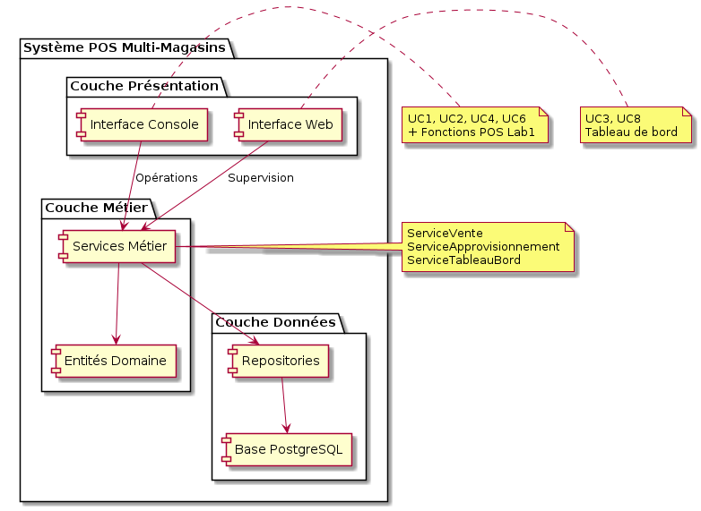
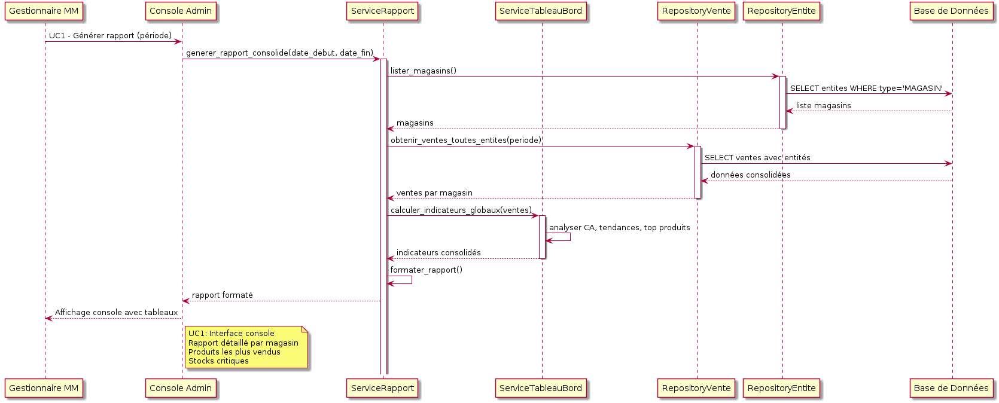
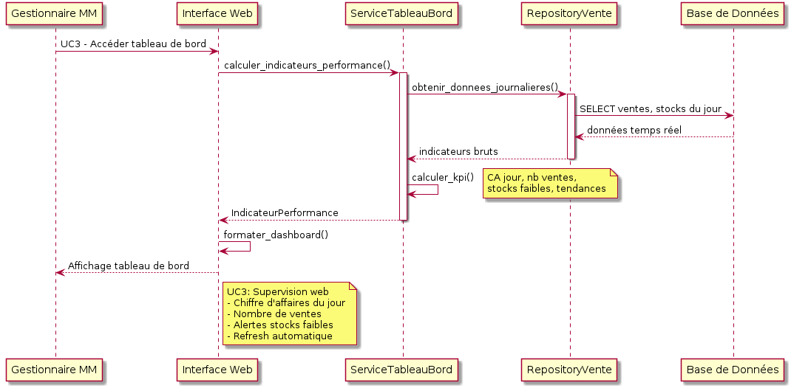
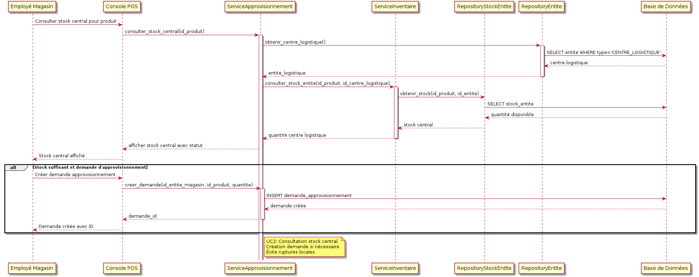
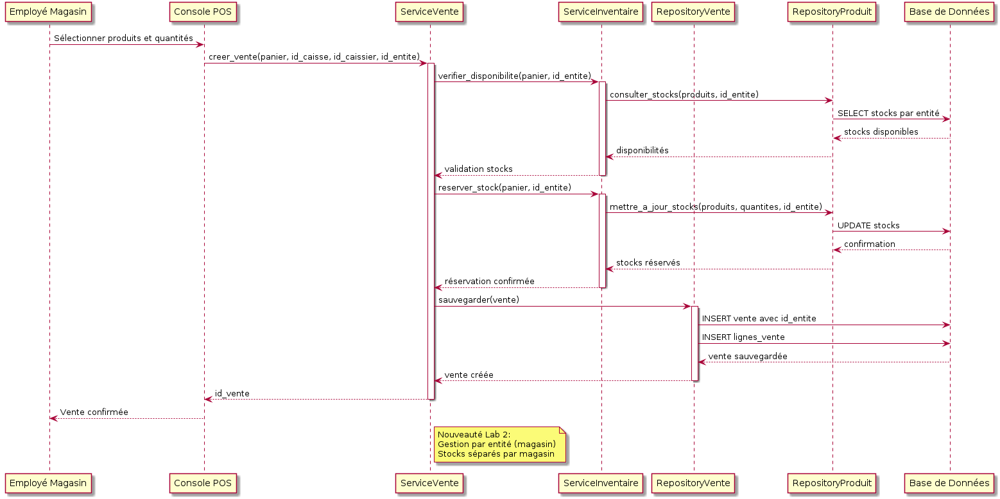
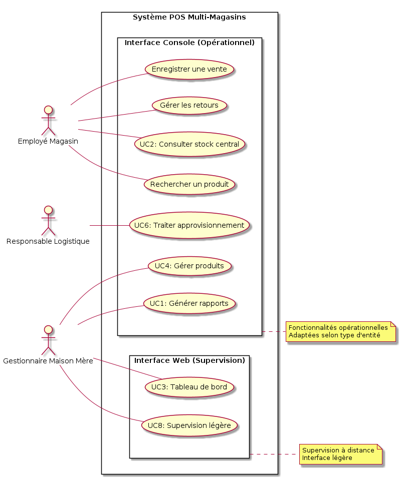

# Rapport Arc42 - Système POS Multi-Magasins LOG430 Lab2

**Projet:** Système de Point de Vente Multi-Magasins  
**Cours:** LOG430 - Architecture Logicielle  
**Laboratoire:** Lab 2  
**Date:** 9 juin 2025
**Etudiant:** Melvin SIADOUS  

---

## Table des matières

1. [Introduction et objectifs](#1-introduction-et-objectifs)
2. [Contraintes d'architecture](#2-contraintes-darchitecture)
3. [Contexte et périmètre du système](#3-contexte-et-périmètre-du-système)
4. [Stratégie de solution](#4-stratégie-de-solution)
5. [Vue de construction](#5-vue-de-construction)
6. [Vue runtime](#6-vue-runtime)
7. [Vue de déploiement](#7-vue-de-déploiement)
8. [Concepts transversaux](#8-concepts-transversaux)
9. [Décisions d'architecture (ADR)](#9-décisions-darchitecture-adr)
10. [Qualité et risques](#10-qualité-et-risques)
11. [Annexes](#11-annexes)

---

## 1. Introduction et objectifs

### 1.1 Objectifs du système

Le système de point de vente multi-magasins est conçu pour gérer les opérations commerciales d'une entreprise possédant cinq magasins, un centre logistique et une maison mère. Ce système constitue l'évolution naturelle du laboratoire 1 vers une architecture plus complexe et distribuée.

### 1.2 Évolution du projet

#### Repositories GitHub
- **Lab 0** : [https://github.com/MelvinSDRS/log430-lab0](https://github.com/MelvinSDRS/log430-lab0)
- **Lab 1** : [https://github.com/MelvinSDRS/log430-lab1](https://github.com/MelvinSDRS/log430-lab1)
- **Lab 2** : [https://github.com/MelvinSDRS/log430-lab2](https://github.com/MelvinSDRS/log430-lab2)

#### Progression architecturale
- **Lab 1** : Architecture client/serveur 2-tier pour un magasin (3 caisses)
- **Lab 2** : Architecture 3-tier multi-magasins avec interface web MVC

---

## 2. Contraintes d'architecture

### 2.1 Contraintes techniques

- **Langage** : Python 3.8+
- **Base de données** : PostgreSQL
- **Conteneurisation** : Docker et Docker Compose
- **Interface web** : Flask (MVC)
- **CI/CD** : GitHub Actions

### 2.2 Contraintes fonctionnelles

- Support de 5 magasins simultanés
- Interface console pour opérations quotidiennes
- Interface web pour supervision
- Gestion centralisée des stocks
- Système de rapports

### 2.3 Contraintes non-fonctionnelles

- **Performance** : Support de transactions simultanées
- **Disponibilité** : 99% uptime pendant les heures d'ouverture
- **Évolutivité** : Ajout facile de nouveaux magasins
- **Maintenabilité** : Code modulaire et documenté

---

## 3. Contexte et périmètre du système

### 3.1 Contexte métier

Le système évolue d'un environnement mono-magasin (Lab 1) vers un écosystème multi-magasins comprenant :
- **5 magasins** : POS Vieux-Montréal, Plateau Mont-Royal, Quartier des Spectacles, Mile End, Westmount
- **1 centre logistique** : Gestion centralisée des stocks
- **1 maison mère** : Supervision et administration

### 3.2 Besoins fonctionnels (MoSCoW)

#### Must Have (Implémentés)
- **UC1** : Génération de rapports consolidés des ventes (Console - Maison mère)
- **UC2** : Consultation stock central et réapprovisionnement (Console - Magasins)
- **UC3** : Tableau de bord de supervision (Web - Maison mère)

#### Should Have (Implémentés)
- **UC4** : Gestion des produits centralisée (Console - Maison mère)
- **UC6** : Traitement des approvisionnements (Console - Centre logistique)

#### Could Have (Partiellement implémentés)
- **UC7** : Détection des ruptures critiques
- **UC8** : Interface web minimale pour supervision

---

## 4. Stratégie de solution

### 4.1 Architecture 3-tier distribuée

**Tier 1 - Persistance** :
- PostgreSQL centralisé (`pos_multimagasins`)
- Gestion des données consolidées
- Index optimisés pour les requêtes critiques

**Tier 2 - Services métier** :
- Services centralisés réutilisés du Lab 1
- Nouveaux services : Approvisionnement, TableauBord
- API de synchronisation entre entités

**Tier 3 - Présentation** :
- **Interface Console** : Opérations métier (UC1, UC2, UC4, UC6)
- **Interface Web** : Supervision légère (UC3, UC8)

### 4.2 Séparation des responsabilités

#### Interface console (Opérationnelle)
- Toutes les fonctionnalités métier et opérationnelles
- Adaptée selon le type d'entité (MAGASIN/CENTRE_LOGISTIQUE/MAISON_MERE)
- Réutilisation maximale des services du Lab 1

#### Interface web (Supervision)
- Supervision légère uniquement
- Tableaux de bord et indicateurs
- Aucune fonctionnalité opérationnelle

---

## 5. Vue de construction

### 5.1 Architecture des composants

```
src/
├── domain/           # Entités métier étendues
│   ├── entities.py
│   └── services.py
├── persistence/      # Couche données
│   ├── models.py    # Modèles SQLAlchemy
│   └── repositories.py
├── client/          # Interface console étendue
│   └── console.py
└── web/             # Interface web supervision
    ├── app.py       # Application Flask (4 routes)
    └── templates/   # Templates HTML légers
```


### 5.2 Diagramme de classes


### 5.3 Services métier

**Services réutilisés (Lab 1)** :
- ServiceProduit : Recherche multi-magasins
- ServiceVente : Ventes par magasin
- ServiceInventaire : Stocks multi-entités
- ServiceTransaction : Transactions distribuées

**Nouveaux services (Lab 2)** :
- ServiceApprovisionnement : Demandes et transferts
- ServiceRapport : Rapports consolidés
- ServiceTableauBord : Indicateurs supervision

### 5.4 Vue composants


---

## 6. Vue runtime

### 6.1 Processus principaux

#### Processus de vente (hérité Lab 1)
1. Recherche produit
2. Ajout au panier
3. Calcul total
4. Traitement paiement
5. Mise à jour stock

#### Processus de rapport consolidé (UC1)
1. Sélection période et critères
2. Agrégation données multi-magasins
3. Calcul indicateurs
4. Génération rapport formaté

#### Processus d'approvisionnement (UC2 + UC6)
1. Consultation stock central (magasin)
2. Création demande approvisionnement
3. Validation demande (centre logistique)
4. Transfert stock et mise à jour

### 6.2 Scénarios cas d'utilisation

#### UC1 - Génération de rapport consolidé (Console)



#### UC3 - Tableau de bord supervision (Web)



#### Recherche d'un produit



#### Retour d'un produit


#### Processus de vente multi-magasins



### 6.3 Cas d'utilisation métier



**3 acteurs principaux :**
- Employé Magasin : 4 cas d'usage (ventes, retours, consulter stock, recherche)
- Responsable Logistique : 1 cas d'usage (traiter approvisionnement)
- Gestionnaire Maison Mère : 4 cas d'usage (gestion produits, rapports, tableau de bord, supervision)

---

## 7. Vue de déploiement

### 7.1 Architecture Docker

```yaml
services:
  postgres:           # Base centralisée
  pos-magasin-1:     # Console Vieux-Montréal (ENTITE_ID=1)
  pos-magasin-2:     # Console Plateau (ENTITE_ID=2)
  pos-magasin-3:     # Console Spectacles (ENTITE_ID=3)
  pos-magasin-4:     # Console Mile End (ENTITE_ID=4)
  pos-magasin-5:     # Console Westmount (ENTITE_ID=5)
  pos-logistique:    # Console Centre logistique (ENTITE_ID=6)
  pos-maisonmere:    # Console + Web Maison mère (ENTITE_ID=7)
  pos-web:           # Interface web supervision (Port 5000)
```


---

## 8. Concepts transversaux

### 8.1 Gestion des données

- **Cohérence** : Transactions ACID PostgreSQL
- **Intégrité** : Contraintes référentielles
- **Performance** : Index optimisés pour requêtes critiques

### 8.2 Logging et observabilité

- Logs applicatifs rotatifs
- Métriques de performance
- Traces des transactions critiques

### 8.3 Sécurité

- Connexions base de données sécurisées
- Isolation des conteneurs Docker
- Variables d'environnement pour configuration

---

## 9. Décisions d'architecture (ADR)

### 9.1 ADR 001: Choix de la plateforme

**Contexte** : Besoin d'une plateforme simple, robuste et autonome pour le système POS.

**Décision** : Utilisation de **Python** comme langage principal.

**Justification** :
- Simplicité et lisibilité facilitant la maintenance
- Écosystème riche et packages disponibles
- Portabilité multi-plateforme
- Intégration facile avec bases de données

### 9.2 ADR 002: Stratégie de persistance

**Contexte** : Gestion des données multi-magasins avec cohérence et performance.

**Décision** : PostgreSQL avec SQLAlchemy comme ORM.

**Justification** :
- Support transactionnel ACID
- Performance pour requêtes complexes
- ORM facilitant la maintenance
- Évolutivité pour croissance future

### 9.3 ADR 003: Séparation des responsabilités

**Contexte** : Assurer maintenabilité et évolutivité du système.

**Décision** : Architecture 3-tier avec couches distinctes.

**Couches** :
1. **Présentation** : Console + Web
2. **Logique Métier** : Services et entités
3. **Persistance** : Repositories et ORM

**Avantages** :
- Modularité et clarté des responsabilités
- Meilleure testabilité
- Réutilisabilité des composants

### 9.4 ADR 004: Architecture MVC pour interface web

**Contexte** : Évolution vers interface web pour supervision multi-magasins.

**Décision** : Pattern MVC avec Flask pour interface web légère.

**Structure** :
- **Model** : Services métier réutilisés du Lab 1
- **View** : Templates HTML minimalistes
- **Controller** : Routes Flask pour UC3 et UC8

**Justification** :
- Séparation claire des responsabilités
- Réutilisation de la logique métier existante
- Interface web complémentaire à la console

### 9.5 ADR 005: Framework web Flask

**Contexte** : Choix du framework pour l'interface web de supervision.

**Décision** : Flask pour simplicité et légèreté.

**Justification** :
- Framework minimaliste adapté aux besoins
- Intégration facile avec SQLAlchemy
- Courbe d'apprentissage réduite
- Parfait pour interface de supervision légère

---

## 10. Qualité et risques

### 10.1 Métriques de qualité

#### Performance
- Support de transactions simultanées
- Temps de réponse < 2 secondes pour rapports
- Index optimisés pour requêtes critiques

#### Fiabilité
- Transactions ACID pour cohérence des données
- Gestion d'erreurs avec rollback
- Tests automatisés (unitaires + intégration)

#### Maintenabilité
- Architecture modulaire 3-tier
- Documentation Arc42 complète
- 5 ADRs structurés
- Code commenté et typé

#### Évolutivité
- Ajout facile de nouveaux magasins
- Variables d'environnement pour configuration
- Services réutilisables

### 10.2 Risques techniques

#### Risque 1: Performance base de données
- **Probabilité** : Moyenne
- **Impact** : Élevé  
- **Mitigation** : Index optimisés, requêtes optimisées

#### Risque 2: Complexité multi-conteneurs
- **Probabilité** : Faible
- **Impact** : Moyen
- **Mitigation** : Docker Compose, documentation déploiement

#### Risque 3: Cohérence des données
- **Probabilité** : Faible
- **Impact** : Élevé
- **Mitigation** : Transactions ACID, tests d'intégration

### 10.3 Tests et validation

#### Tests unitaires
- Services métier (ServiceVente, ServiceInventaire, etc.)
- Repositories (CaisseRepository, ProduitRepository, etc.)

#### Tests d'intégration
- Workflows multi-magasins
- Processus d'approvisionnement
- Génération de rapports

#### Tests performance
- Charge simultanée (50+ caisses)
- Requêtes complexes (rapports consolidés)
- Métriques temps de réponse

#### Pipeline CI/CD
- GitHub Actions automatisé
- Tests sur push/pull request
- Déploiement Docker validé

---

## 11. Annexes

### 11.1 Instructions de déploiement

```bash
# Cloner le repository
git clone https://github.com/MelvinSDRS/log430-lab2

# Démarrer l'architecture complète
docker compose up -d

# Vérifier les services
docker compose ps

# Accès interface web
http://localhost:5000

# Accès console magasin
docker compose exec pos-magasin-1 python main.py
```

### 11.2 Configuration des entités

| Service | Entité | Type | ENTITE_ID | Interface |
|---------|--------|------|-----------|-----------|
| pos-magasin-1 | Vieux-Montréal | MAGASIN | 1 | Console |
| pos-magasin-2 | Plateau | MAGASIN | 2 | Console |
| pos-magasin-3 | Spectacles | MAGASIN | 3 | Console |
| pos-magasin-4 | Mile End | MAGASIN | 4 | Console |
| pos-magasin-5 | Westmount | MAGASIN | 5 | Console |
| pos-logistique | Centre Logistique | CENTRE_LOGISTIQUE | 6 | Console |
| pos-maisonmere | Maison Mère | MAISON_MERE | 7 | Console |
| pos-web | Web Interface | - | - | Web |

### 11.3 Architecture des données

#### Tables principales
- **entites** : Magasins, centre logistique, maison mère
- **caisses** : 2 caisses par magasin (10 total)
- **produits** : Catalogue centralisé
- **stocks** : Stock par entité
- **ventes** : Ventes par magasin
- **demandes_approvisionnement** : Flux logistique

#### Relations clés
- entites 1:N caisses
- entites 1:N stocks  
- entites 1:N ventes
- entites 1:N demandes_approvisionnement